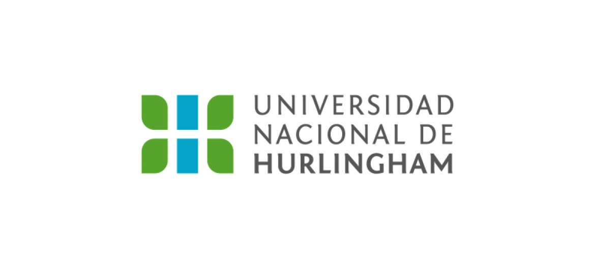

# Programación con objetos I
## Presentación Personal

### Datos Personales
- Mi nombre es: Matías Arévalo
- Vivo en Merlo, Buenos Aires
- Tengo 21 años
- Actualmente estoy cursando la carrera de Programación en la UNAHUR. Elegí la carrera porque siempre me interesó la tecnología y quería aprender más sobre cómo funciona el desarrollo de      software.

- Todavía estoy dando mis primeros pasos en programación, pero mi objetivo es seguir aprendiendo y poder dedicarme profesionalmente a esto en el futuro.

### Otra Información
- Actualmente trabajo como tornero
- Me interesa mucho la tecnología y la programación
- Me gusta el fútbol y hacer deporte
- En mi tiempo libre me gusta jugar videojuegos y aprender cosas nuevas
- Mi objetivo es seguir aprendiendo programación y poder trabajar de esto en el futuro
